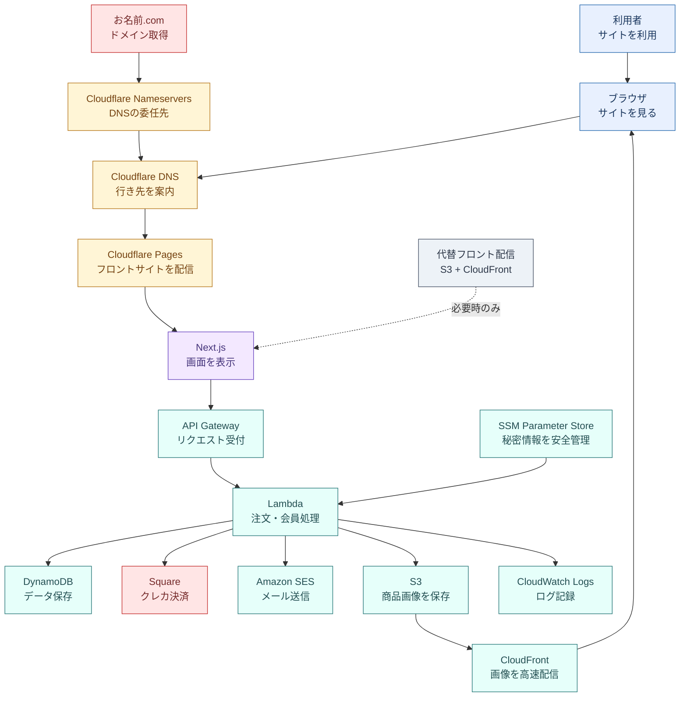
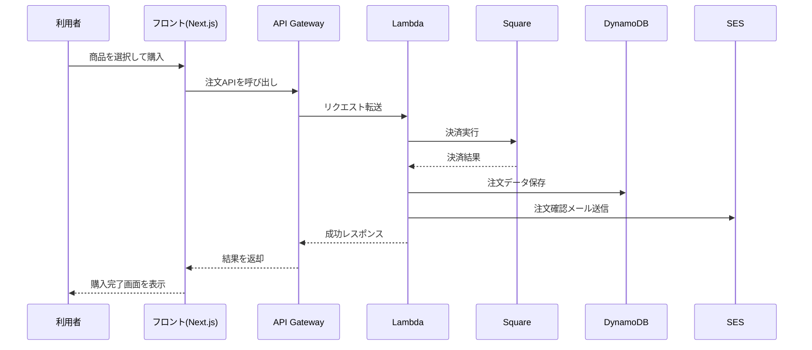
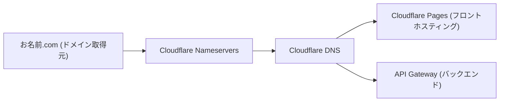

# EC Site アーキテクチャ構成図

このドキュメントは、現在の `ecsite` の構成を「誰でもわかる」ように図式化したものです。

## 1. ひと目でわかる全体像

色分けの凡例

- 青系: 利用者側 (利用者・ブラウザ)
- 黄系: Cloudflare系 (Nameservers / DNS / Pages)
- 水色系: AWS系 (API Gateway / Lambda / DynamoDB / SES / S3 / CloudFront / SSM / CloudWatch)
- 紫系: アプリ層 (Next.js)
- 赤系: 外部サービス (お名前.com / Square)
- グレー系: 代替構成 (S3 + CloudFront 経路)

## 2. 役割をやさしく説明

- フロントエンド: 画面を表示する部分。ユーザーの操作を受け取る。
- API Gateway + Lambda: 注文やログインなど「処理の本体」。
- DynamoDB: 会員情報、商品、注文などのデータ保管庫。
- Square: クレジットカード決済を担当。
- SES: 登録確認メールや通知メールを送る。
- S3 + CloudFront(画像): 商品画像を保存して高速配信する。
- SSM Parameter Store: APIキーなどの機密値を安全に管理する。

## 3. 注文時の流れ(例)

## 4. デプロイ先の補足

このリポジトリには、フロント配信として以下の運用パターンが存在します。

- AWSパターン: `S3 + CloudFront` ( `frontend/infra/cloudformation.yaml` )
- Cloudflareパターン: `Cloudflare Pages` ( `CLOUDFLARE_DEPLOYMENT_GUIDE.md` )

どちらのパターンでも、バックエンドは `API Gateway + Lambda` を利用する構成です。

現在の運用では、フロントサイトは `Cloudflare Pages` でホストしています。

ドメイン運用は以下の構成です。

- ドメイン取得元(レジストラ): `お名前.com`
- ネームサーバー(NS): `Cloudflare` のネームサーバーへ移管済み

## 5. ドメインとDNSの構成(現在)

